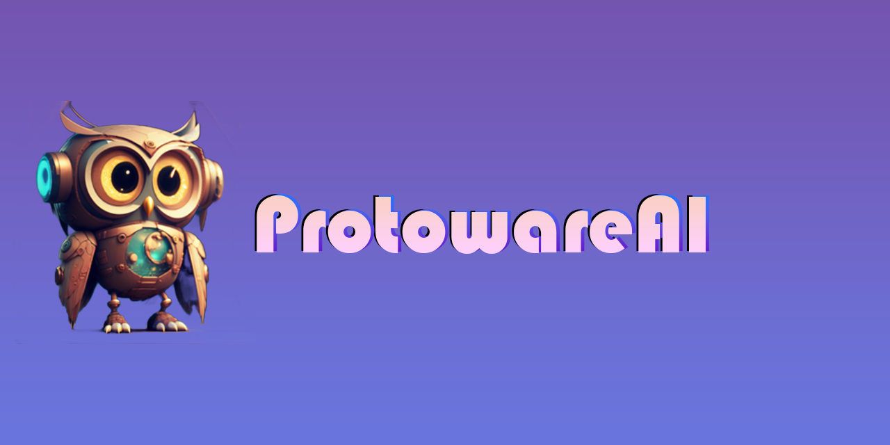

    
    
    
    
  </a>

#ProtowareAI: Your All-Purpose Chatbot Companion
ProtowareAI is an AI-powered chatbot that provides a wide range of functionalities to its users. With ProtowareAI, you can solve puzzles, create images, and engage in conversation on any topic you choose. Whether you're looking for help with a brain-teaser, want to generate custom graphics, or just need someone to talk to, ProtowareAI has got you covered.

Designed with both fun and functionality in mind, ProtowareAI is an ideal tool for anyone looking to enhance their productivity, creativity, or simply pass the time with a stimulating chatbot. Its intuitive interface and advanced NLP capabilities make it easy to use and understand, while its ability to learn and adapt to user preferences ensures that every conversation is tailored to your needs.

Whether you're a student, professional, or simply looking for a fun and engaging chatbot experience, ProtowareAI is the perfect tool for exploring your creativity, solving puzzles, and engaging in meaningful conversation with an AI-powered friend.

#Current status:

- [x] Customizable

- [x] Dataset

- [X] NLP

- [X] UI

- [ ] integrations

- [ ] multilingualism

- [X] Error handling

- [ ] Performance optimization

- [ ] Security features

- [ ] User feedback mechanism

- [ ] Mobile responsiveness

- [ ] Unit testing

- [ ] Integration testing

- [ ] User documentation

- [ ] Technical documentation

- [ ] Analytics and tracking features

- [ ] Accessibility features

- [ ] Social media sharing capabilities

- [ ] Email notifications

- [ ] Data visualization features

- [ ] Login Screen

# Assistant Skills And Features
